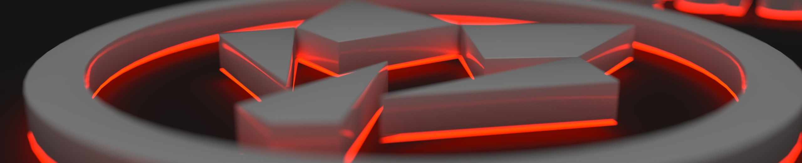

Hi, I'm Patrick. During the day, I'm a research scientist in the Neurophysics Department at the [Max Planck Institute for Human Cognitive and Brain Sciences](https://www.cbs.mpg.de/en) where my focus is on developing algorithms to quantify and analyse high-resolution MRI datasets.
In my free
